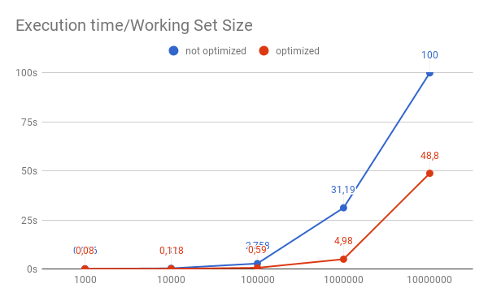

# Benchmark Data-Oriented Entity System

Thanks to [ooflorent](https://github.com/ooflorent) for the benchs review and his help.

## Benches

Here are the result on my `Intel(R) Core(TM) i7-4750HQ CPU @ 2.00GHz`.
I use a `node 9.3.0` version.
The benchmark run with `1 000 000` of cells and `1000` update on them.

* [isolate-0x55f480c91ef0-v8.log][nopti] = profile of none optimised version
* [isolate-0x5597250bfef0-v8.log][opti] = profile of optimised version

## Execution time

You can get the execution time of the two program with the `time` UNIX command e.g.:

* `time node cell_system.js`

* `time node cell_system_optimised.js`

## Profile them with node profiler

`node --prof cell_system.js`

`node --prof cell_system_optimised.js`

And then read the *.log with `prof-process` to analyse them.

`node --prof-process your.log`

## Perf

Measure the cache hit/miss and cpu time of the program

`perf stat cell_system.js`

`perf stat -e cache_misses, L1-dcache-load-misses cell_system.js`

[nopti]: ./isolate-0x55f480c91ef0-v8.log
[opti]: ./isolate-0x5597250bfef0-v8.log